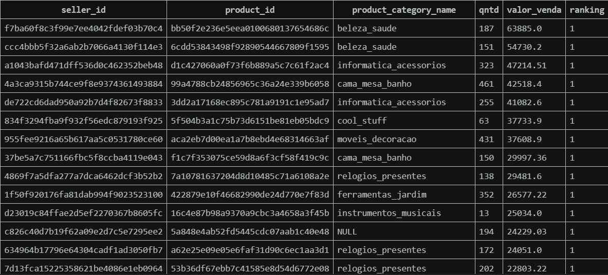

# 📊 Análise da Categoria de Produto Mais Vendida por Seller

## 📌 Sobre o projeto
Este projeto tem como objetivo identificar, para cada seller, qual é a **categoria de produto mais vendida**, considerando:

- Quantidade de pedidos  
- Valor total de vendas  

A análise foi realizada utilizando SQL sobre o dataset público de e-commerce disponibilizado pela Olist.

---

## 🎯 Objetivo da análise
Encontrar a categoria de produto mais relevante por seller, priorizando:

1. Maior volume de vendas (quantidade de pedidos)  
2. Em caso de empate, maior valor total de vendas  

---

## 🛠️ Ferramentas utilizadas
- SQL  
- Funções de agregação (`COUNT`, `SUM`)  
- CTE (Common Table Expression)  
- Funções de janela (`ROW_NUMBER`)  

---

## 🧠 Estratégia
A solução foi construída em duas etapas:

1. **Agregação dos dados**
   - Agrupamento por seller e categoria de produto  
   - Cálculo da quantidade de pedidos  
   - Soma do valor total de vendas  

2. **Ranqueamento**
   - Utilização de `ROW_NUMBER()` para ordenar as categorias por seller  
   - Critérios:
     - Maior quantidade vendida  
     - Maior valor de vendas (desempate)  

---

## 📂 Query

```sql
with sellers as (
    select 
        t1.seller_id,
        t2.product_category_name,
        count(distinct t1.order_id) as qntd,
        round(sum(t1.price), 2) as valor_venda
    from tb_order_items as t1
    left join tb_products as t2
        on t1.product_id = t2.product_id
    group by 1,2
),

rankeamento as (
    select *,
        row_number() over (
            partition by seller_id 
            order by qntd desc, valor_venda desc
        ) as ranking
    from sellers
)

select *
from rankeamento
where ranking = 1
order by valor_venda desc;
```

---

## 📸 Exemplo de resultado



---

## 💡 Insight
A análise permite identificar quais categorias de produtos têm maior relevância para cada seller, destacando padrões de vendas que podem apoiar decisões comerciais, como priorização de estoque e foco em categorias mais rentáveis.

---

## 📊 Possíveis aplicações
- Identificação de categorias estratégicas por seller  
- Apoio a decisões comerciais  
- Otimização de catálogo e estoque  
- Análise de performance de vendas  

---

## 📁 Dataset
- Olist E-commerce Public Dataset  

---
## 📸 Exemplo de resultado


